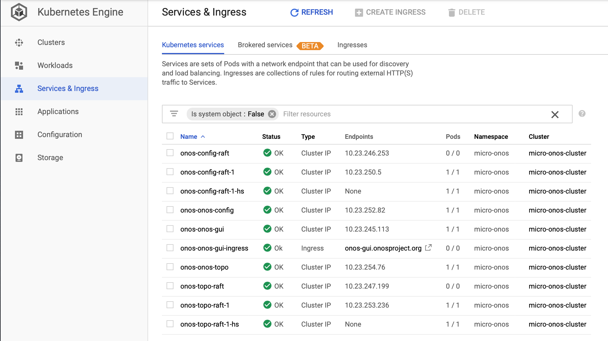

# Deploying onos micro-services on GCP with HELM

This page provides a set of instructions to deploy micro-onos with HELM on the Google Compute Platform, a.k.a. [GCP](gcp).

## Prerequisites

The following set of instruction assumes:

* Google cloud account is set-up, configured and working. 
* Google cloud SDK is installed and as per [instructions](Sdk_install).
* kubectl CLI tool is installed and working as expected. 

## Create a project (optional)

To create and use kubernetes cluster on GCP you'll need to have a GCP project. 

> If you already have a project configured that you can use feel free to skip this step.

To create a project google provides a set of [instructions](project_instr) please follow them and name your project as you prefer.
For consistency this guide will use `micro-onos`

In short:
```bash
gcloud projects create micro-onos
```

## Initialize your gcloud environment with account, project and region
### Intitialize
To prime your environment:
```bash
gcloud init
``` 
### Account
when prompted to login please select the same account as the one you have the GCP setup. 
An example is as following:
```bash 
You must log in to continue. Would you like to log in (Y/n)?  Y

You are logged in as: [andrea@opennetworking.org].
```
### Project
When prompted to pick the project to work with select the one you have created, in our case `micro-onos`.

```bash
Pick cloud project to use:
 [1] micro-onos
 [2] Create a new project
Please enter numeric choice or text value (must exactly match list
item):  1

Your current project has been set to: [micro-onos].
```
### Region
When prompted for the region 
```bash
Do you want to configure a default Compute Region and Zone? (Y/n)?
```
you can leave it to gcloud to manage it or set it youself. 
If `n` you select the list of regions can be retreived by 
```bash
gcloud compute regions list
```

## Create a Kubernetes cluster

To create your kubernetes cluster in the `micro-onos` cluster:
```bash
gcloud container clusters create micro-onos-cluster \
  --enable-stackdriver-kubernetes \
  --subnetwork default \
  --num-nodes 2
```
This will create a `micro-onos-cluster` with 2 nodes and logging enabled. 

The output of should look something like:
```bash
Created [https://container.googleapis.com/v1/projects/micro-onos/zones/europe-west1/clusters/micro-onos-cluster].
To inspect the contents of your cluster, go to: https://console.cloud.google.com/kubernetes/workload_/gcloud/europe-west1/micro-onos-cluster?project=micro-onos
kubeconfig entry generated for micro-onos-cluster.
```

If you did not let gcloud pick the region you need to add the `--region` option:
```bash 
gcloud container clusters create micro-onos-cluster \
  --enable-stackdriver-kubernetes \
  --region europe-west1 \
  --subnetwork default \
  --num-nodes 2
```

## Connect and authorize local environment with the cluster
To connect your local environment to the newly created `micro-onos` cluster you need to set the compute zone.  
```bash
gcloud config set compute/zone europe-west1
```
> make sure to have set here the same region the cluster was created in or that you selected at the previous step.

You also need to get the credentials
```bash
gcloud container clusters get-credentials micro-onos-cluster
``` 
and authenticate
```bash
gcloud auth application-default login
```
## Check cluster status

To make sure the cluster is properly created and is accessible:
```bash
kubectl cluster-info
```
the output should look something like
```bash
Kubernetes master is running at https://35.187.168.240
GLBCDefaultBackend is running at https://35.187.168.240/api/v1/namespaces/kube-system/services/default-http-backend:http/proxy
Heapster is running at https://35.187.168.240/api/v1/namespaces/kube-system/services/heapster/proxy
KubeDNS is running at https://35.187.168.240/api/v1/namespaces/kube-system/services/kube-dns:dns/proxy
Metrics-server is running at https://35.187.168.240/api/v1/namespaces/kube-system/services/https:metrics-server:/proxy

To further debug and diagnose cluster problems, use 'kubectl cluster-info dump'.
```


## Deploy `micro-onos` with Helm

Now that you have your K8s cluster on GCP ready and working there is no difference as having any other k8s cluster.
To deploy `micro-onos` you can easily follow the existing [instructions on how to deploy with helm](helm_micro_onos).  

## Observe cluster status
On the GCP user interface the cluster can be seen


Also the services can be monitored. 


## Delete a cluster on GCP
After you have concluded your work remeber to delete the GCP cluster you have created not to incur in useless work and payments. 
```bash
gcloud container clusters delete micro-onos-cluster
```

## Useful Links and resources

* [K8s with Helm on GCP](https://docs.bitnami.com/kubernetes/get-started-gke/)
* [Google cloud command line overview](https://cloud.google.com/sdk/gcloud/)

[gcp]: https://cloud.google.com/
[Sdk_install]: https://cloud.google.com/sdk/install
[project_instr]: https://cloud.google.com/resource-manager/docs/creating-managing-projects
[helm_micro_onos]: https://docs.onosproject.org/developers/deploy_with_helm/